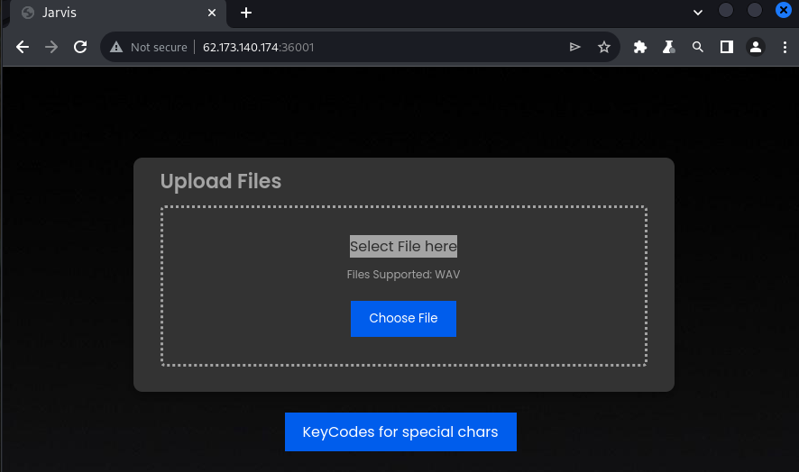
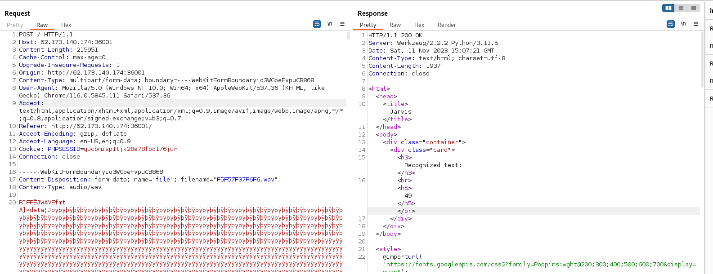
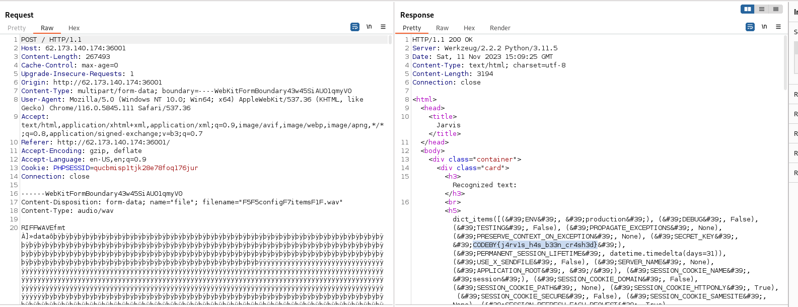

### Jarvis
Level: Medium

Miss Potts called and asked: are you going to play superhero today or are you going to come to the office and do some serious work?

### Solution

On the page there is a form for downloading wav files::




```
KeyCodes

"F1" => "("
"F2" => ")"
"F3" => "*"
"F4" => "/"
"F5" => "{"
"F6" => "}"
"F7" => "."
"F8" => "_"
"F9" => "!"


Example: "Hello World!)" == "Hello World F9F2"
```

We use a converter Text to audio (https://www.narakeet.com/app/text-to-audio/?projectId=d30d1489-b8ca-4ad8-91ad-5c2e8822b312), try to encode ```{{ 7*7 }}``` in format ```F5F57F37F6F6``` to wav-file. Then upload it to the server:



Get the answer 49. Upload payload ```{{config.items}}``` in format ```F5F5configF7itemsF1F1``` in wav file.



Get flag: CODEBY{j4rv1s_h4s_b33n_cr4sh3d}