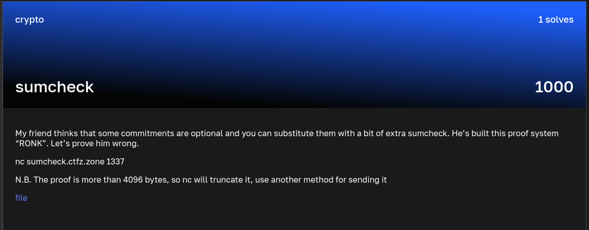

### sumcheck

Points: 1000 \
Category: Crypto \
Author: \
Solves: 1

### Description

My friend thinks that some commitments are optional and you can substitute them with a bit of extra sumcheck. He’s built this proof system “RONK”. Let’s prove him wrong.

nc sumcheck.ctfz.zone 1337

N.B. The proof is more than 4096 bytes, so nc will truncate it, use another method for sending it

file

### Screen

