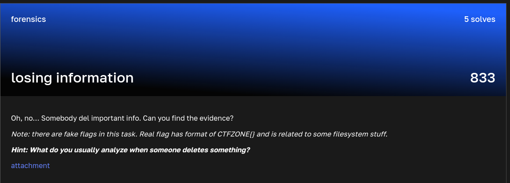

### losing information

Points: 833 \
Category: Forensics \
Author: \
Solves: 5

### Description

Oh, no… Somebody del important info. Can you find the evidence?
Note: there are fake flags in this task. Real flag has format of CTFZONE{} and is related to some filesystem stuff.
Hint: What do you usually analyze when someone deletes something?

attachment

### Screen

