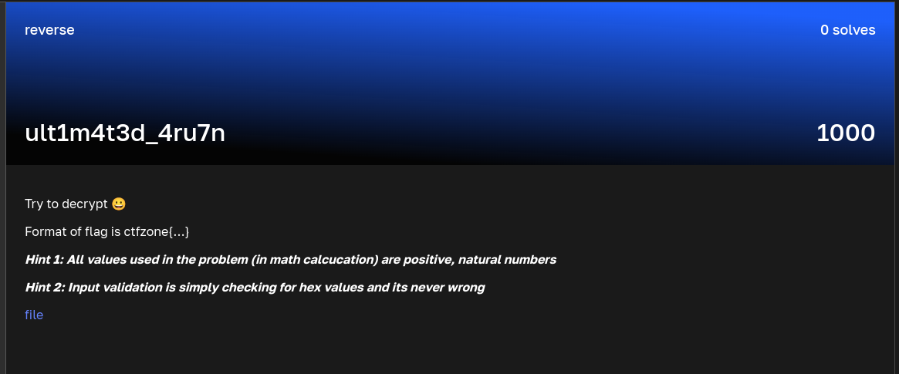

### ult1m4t3d_4ru7n

Points: 1000 \
Category: Reverse \
Author: \
Solves: 0

### Description

Try to decrypt 😀

Format of flag is ctfzone{…}

Hint 1: All values used in the problem (in math calcucation) are positive, natural numbers

Hint 2: Input validation is simply checking for hex values and its never wrong

file

### Screen

