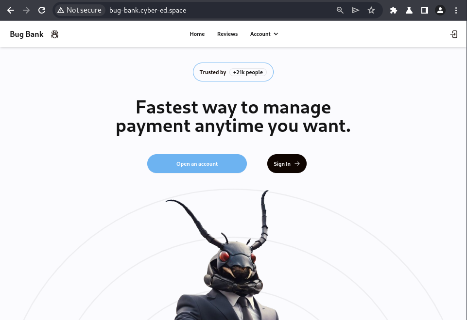
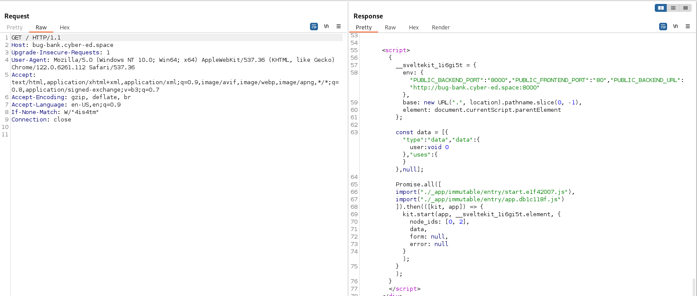
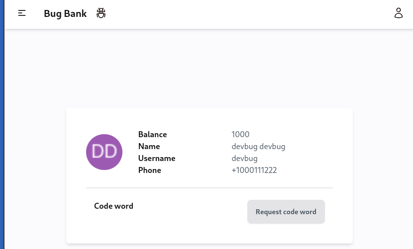
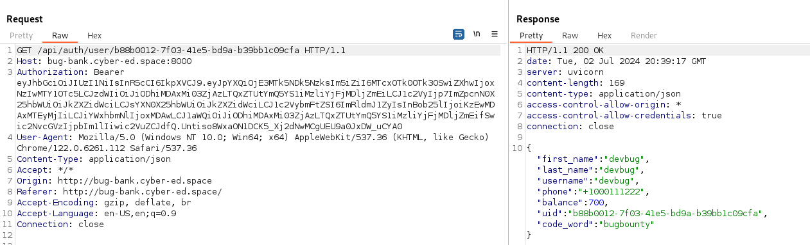
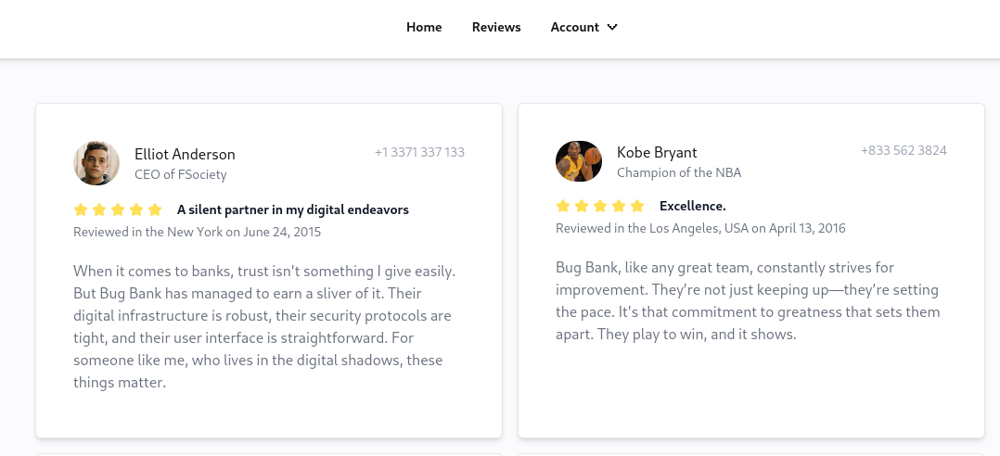
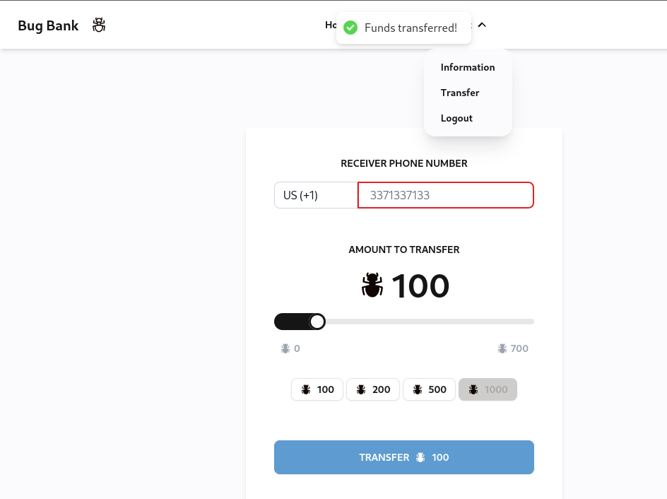
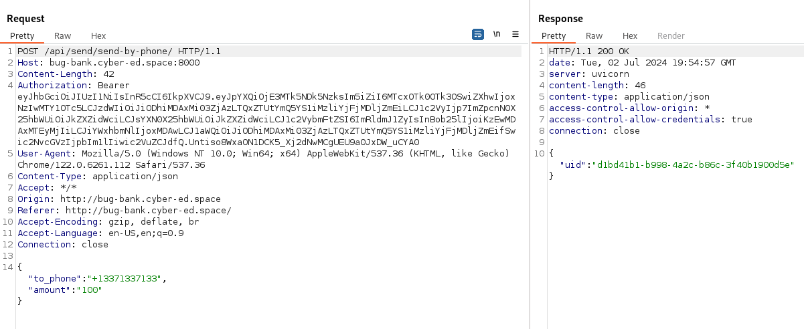
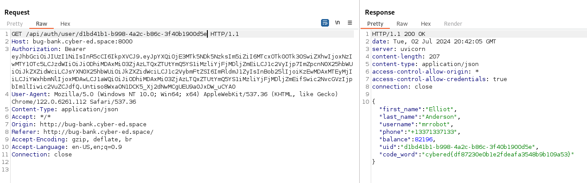

### Bug Bunk
Level: Easy

I wonder what Elliot's code word is?

Task on IDOR in an imaginary Bug Bank, based on a real bug bounty report, from the BI.ZONE Bug Bounty platform

### Solution

See standart start page, when there is the registration form. 



Register the user and study source code, scripts and interested endpoints. Find an interesting script that reveals env:

```
env: {"PUBLIC_BACKEND_PORT":"8000","PUBLIC_FRONTEND_PORT":"80","PUBLIC_BACKEND_URL":"http://bug-bank.cyber-ed.space:8000"}
```



Find an interesting page, when trying to get the code.



Look at the request and response, we see the api address and your uid.



We find a page with reviews where there are several contacts:



We're trying to send Eliot a few credits:



Look at the request and response, we see Eliot's uid:



Okey, what if using Eliot's uid to open the page /api/auth/user/{ eliot euid}:



Found IDOR vulnerability and get flag.