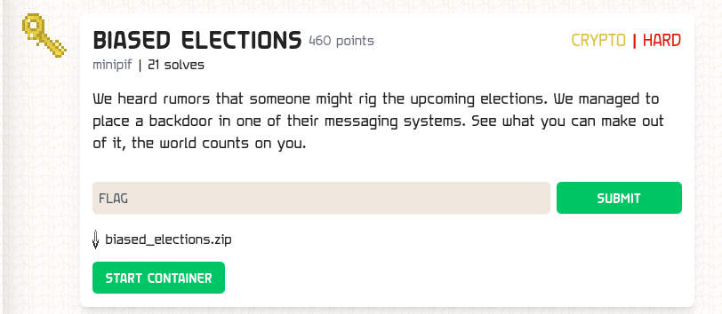

### BIASED ELECTIONS

Points: 460 \
Difficulty: HARD \
Category: Cryptography \
Author: minipif \
Solves: 21

### Description

We heard rumors that someone might rig the upcoming elections. We managed to place a backdoor in one of their messaging systems. See what you can make out of it, the world counts on you.

### Screen

