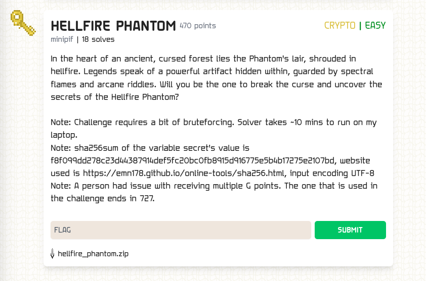

### HELLFIRE PHANTOM

Points: 470 \
Difficulty: Easy \
Category: Cryptography \
Author: minipif \
Solves: 18

### Description

In the heart of an ancient, cursed forest lies the Phantom's lair, shrouded in hellfire. Legends speak of a powerful artifact hidden within, guarded by spectral flames and arcane riddles. Will you be the one to break the curse and uncover the secrets of the Hellfire Phantom?

Note: Challenge requires a bit of bruteforcing. Solver takes ~10 mins to run on my laptop.
Note: sha256sum of the variable secret's value is f8f099dd278c23d44387914def5fc20bc0fb8915d916775e5b4b17275e2107bd, website used is https://emn178.github.io/online-tools/sha256.html, input encoding UTF-8
Note: A person had issue with receiving multiple G points. The one that is used in the challenge ends in 727.

### Screen

