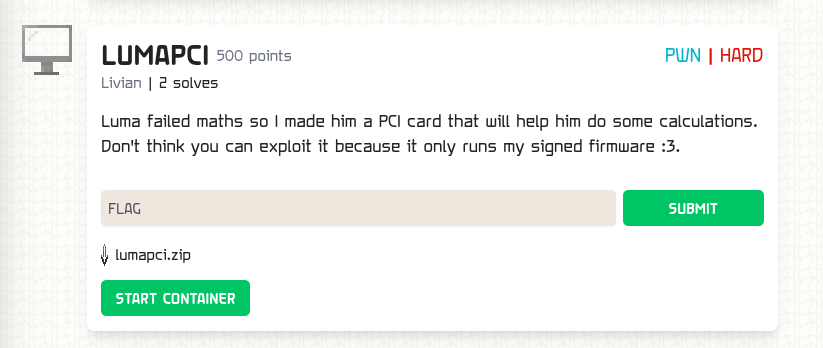

### LUMAPCI

Points: 500 \
Difficulty: Hard \
Category: pwn \
Author: Livian \
Solves: 2

### Description

Luma failed maths so I made him a PCI card that will help him do some calculations. Don't think you can exploit it because it only runs my signed firmware :3.

### Screen

