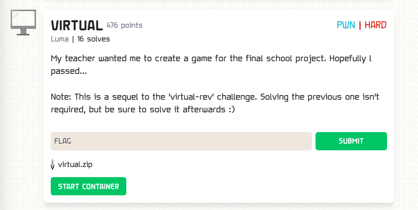

### VIRTUAL

Points: 476 \
Difficulty: Hard \
Category: pwn \
Author: Luma \
Solves: 16

### Description

My teacher wanted me to create a game for the final school project. Hopefully l passed...

Note: This is a sequel to the 'virtual-rev' challenge. Solving the previous one isn't required, but be sure to solve it afterwards :)

### Screen

