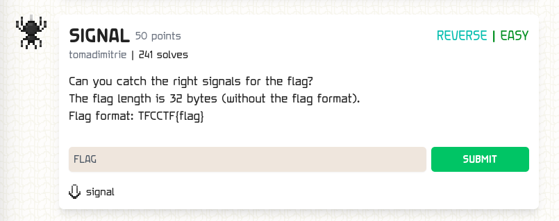

### SIGNAL

Points: 50 \
Difficulty: Easy \
Category: Reverse \
Author: tomadimitrie \
Solves: 241

### Description

Can you catch the right signals for the flag?
The flag length is 32 bytes (without the flag format).
Flag format: TFCCTF{flag}

### Screen

