### Cuteway (Дип-взлом)

Category: medium, web, bypass \
Author: Александр Соколов (@alex_S0k0l0v)

#### Description:

У студентов есть подозрения, что препод продаёт их дипломные работы в онлайне. Нужны веские доказательства. Найдите любые улики, которые помогут поймать его за руку.

Получите доступ к визитной карточке препода на сайте: t-cutaway-o78hk6as.spbctf.net

Сайт работает на опенсорсном движке: cutaway_b39a911.tar.gz

### Solution

We have source code for local deployment and security research. First disabled Captcha in files:
```
- ./sources/services/nginx/frontend/static/js/app.js
- ./sources/services/app/schemas/__init__.py
```

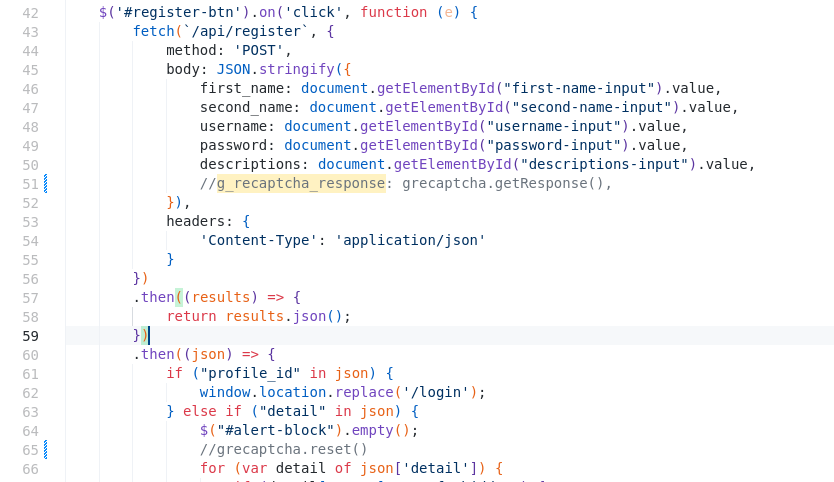

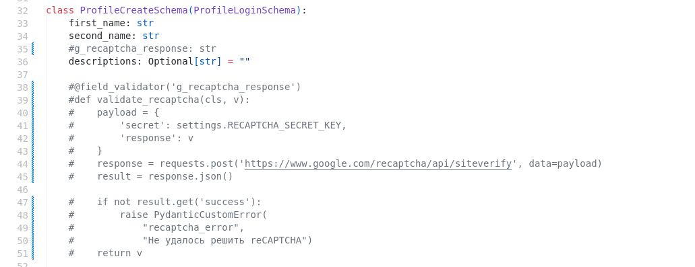


Okey, lets try start application use docker-compose:

```
$ cd sources
$ docker-compose -f docker-compose.yml build
$ docker-compose -f docker-compose.yml up
```

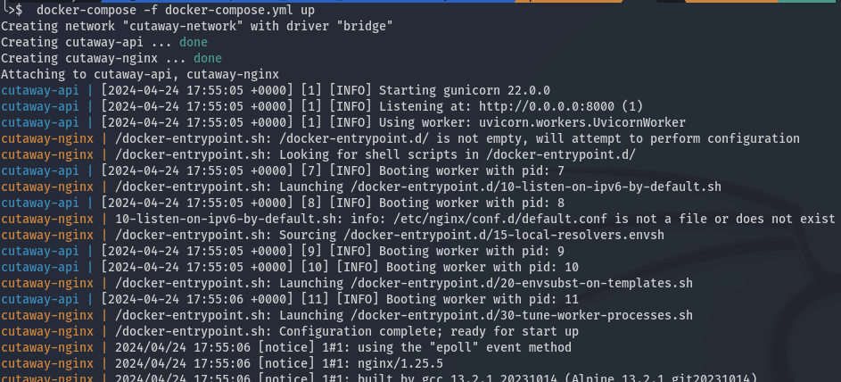

Then open page http://127.0.0.1:20010/register and register:

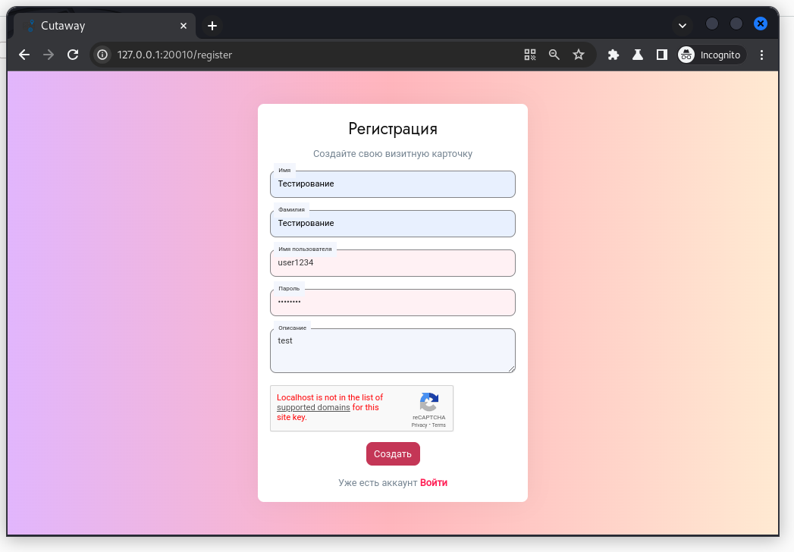

See request and response:

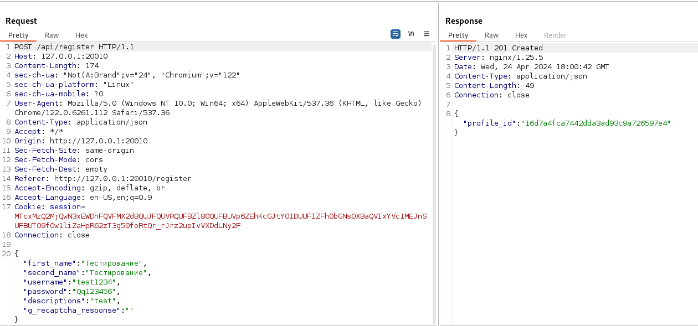


Try login on page and see request and response:


Server responce **access_token** (jwt) and **profile_id**:

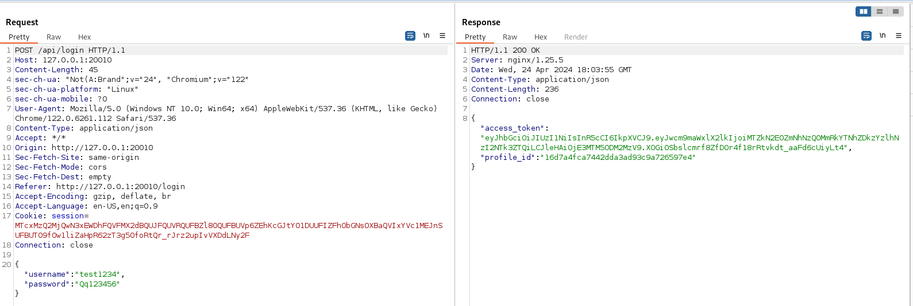

See nginx configs, source code, API with endpoints:

- sources/services/nginx/nginx.conf:

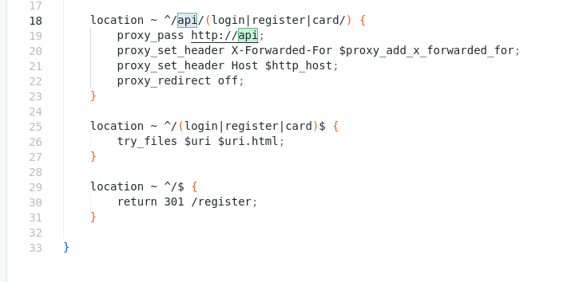

- sources/services/app/api/card.py:

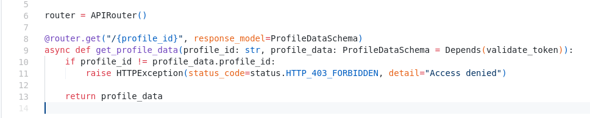

- sources/services/app/utils/_init _.py

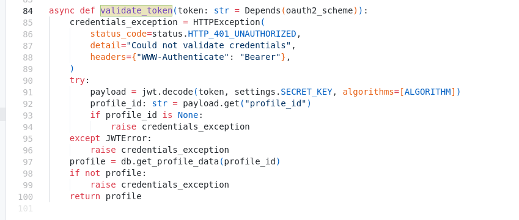

We have to visit the page http://127.0.0.1:20010/api/card/{profile_id} with valid JWT token, try it:

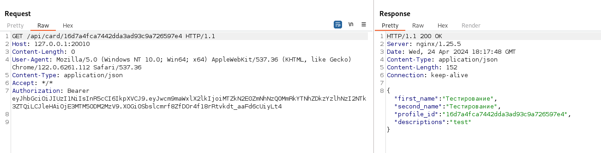

Ok, the task flag will be located /api/card/{profile_id} on the teacher’s page. When run docker-compose then create text-database:

- ./sources/services/app/database/profiles.txt

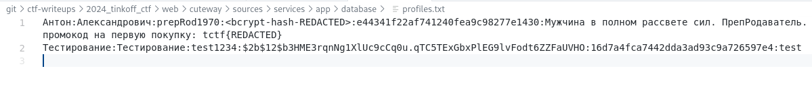

Try look for vulnerabilities in the source code. And finding interesting code who have validation inpuy with regexp:

- ./sources/services/app/schemas/__init__.py:

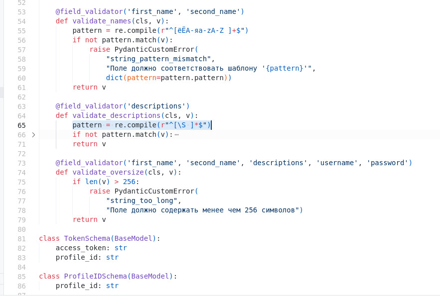

- ./sources/services/app/utils/__init__.py

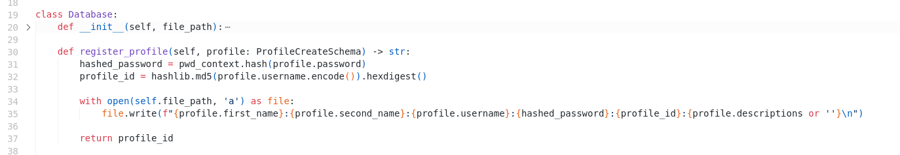


Okey, try bypass authication:

```
$ htpasswd -bnBC 10 "" YOUR_PASSWORD | tr -d ':\n'

> $2y$10$4VJm4VXOBGS26TW7aUAZm.j8lVn56lkRu9U4O6YKK4ctmArbcBRrW
```

Inject parameters into the description field to create exploit user:

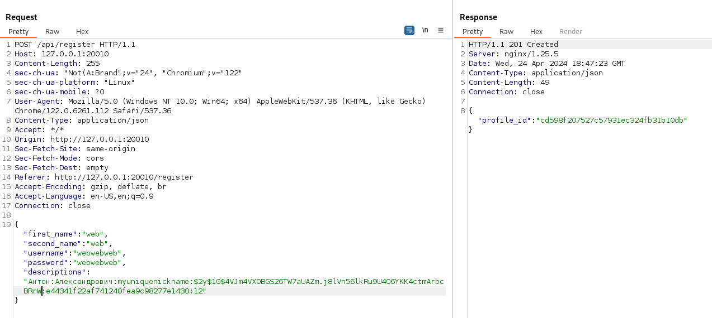

Then login use creads of exploit user and get access_token with profile_id:


Okey get flag:

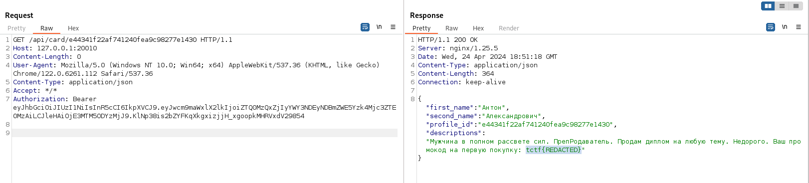